# Craton HSM

[](https://github.com/craton-co/craton-hsm-core/actions/workflows/ci.yml)
[](LICENSE)
[](https://crates.io/crates/craton_hsm)
[](https://docs.rs/craton_hsm)
[](https://codecov.io/gh/craton-co/craton-hsm-core)

> **Not FIPS 140-3 certified.** This software has not undergone CMVP validation.
> See [FIPS Gap Analysis](docs/fips-gap-analysis.md) for details.

**A next-generation PKCS#11 v3.0-compliant Software Hardware Security Module written in pure Rust.**

Craton HSM is an enterprise cryptographic platform combining the compliance of traditional HSMs with modern cloud-native features: post-quantum cryptography, fully homomorphic encryption, hardware attestation, STARK proofs, BLS aggregation, WebAssembly plugins, and multi-protocol cluster networking.

---

## Platform Overview

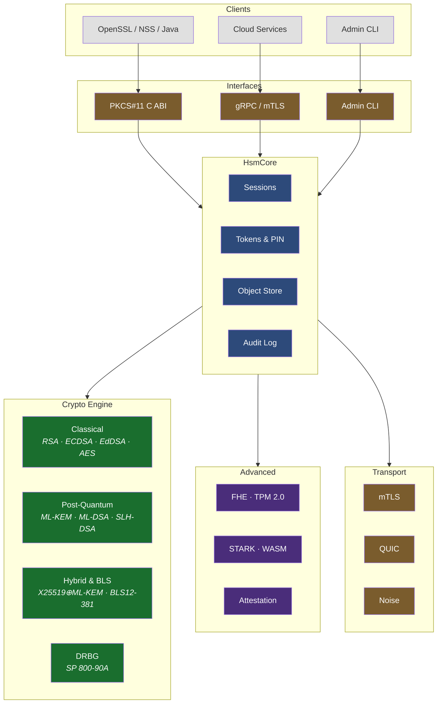

---

## Cryptographic Capabilities

### Algorithm taxonomy

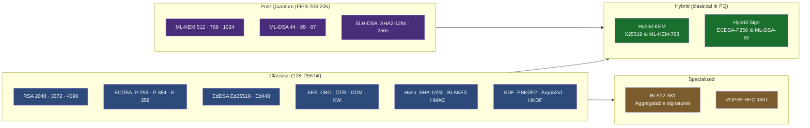

### Hybrid KEM encapsulation flow

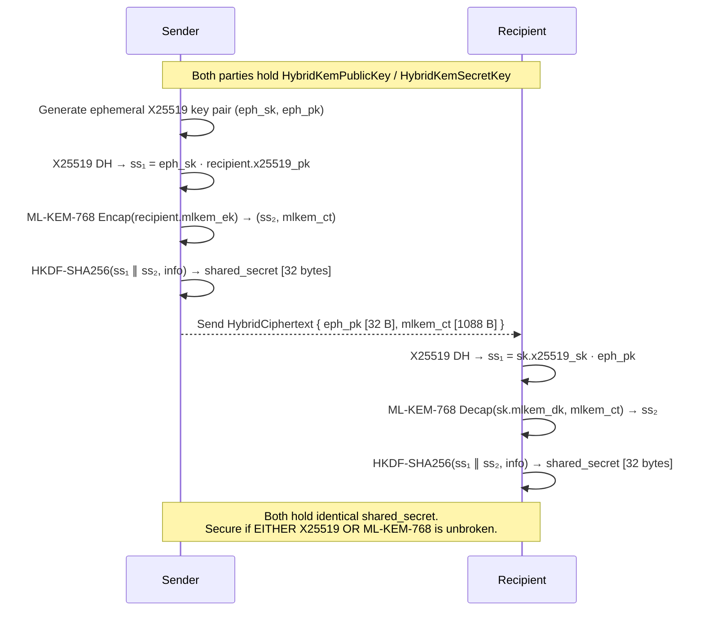

### BLS12-381 signature aggregation

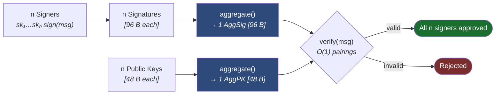

---

## Advanced Capabilities

### Fully Homomorphic Encryption

Compute on encrypted data without decryption — the server never sees plaintext values.

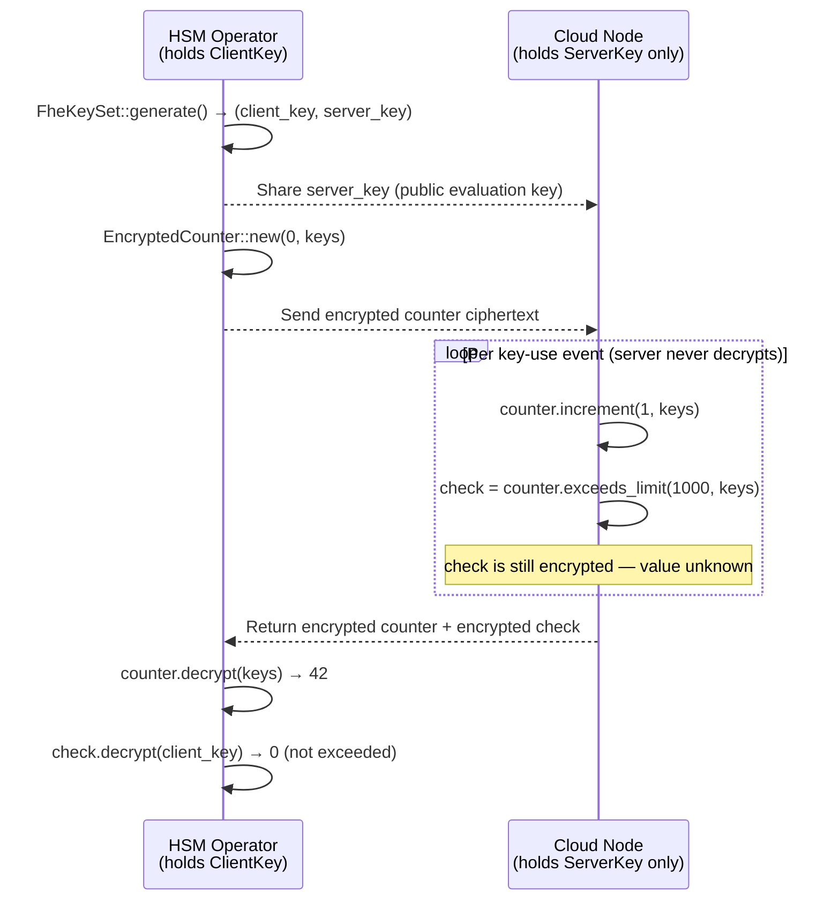

**Use cases:** encrypted key-use counters in untrusted cloud nodes, homomorphic risk scoring without exposing event data, homomorphic key blinding for enclave hand-off.

### TPM 2.0 Hardware Binding

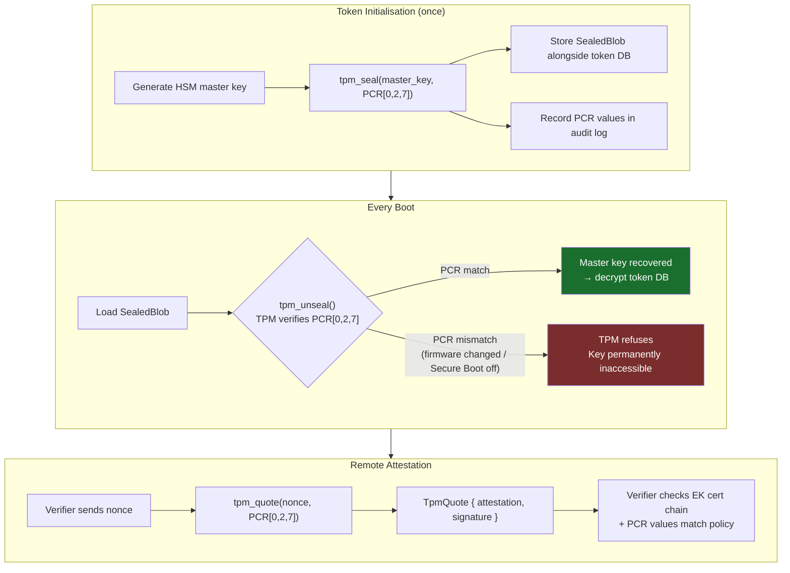

### STARK Proof System

Prove correctness of HSM operations **without revealing secret material** — transparent, post-quantum secure, no trusted setup.

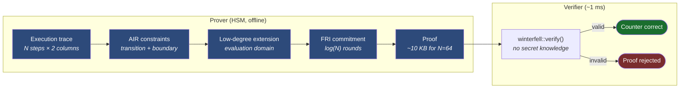

**Properties:** Post-quantum security (hash-based, not pairing-based). Proof size sub-linear in trace length. Verification ~1 ms regardless of computation size.

### Remote Attestation

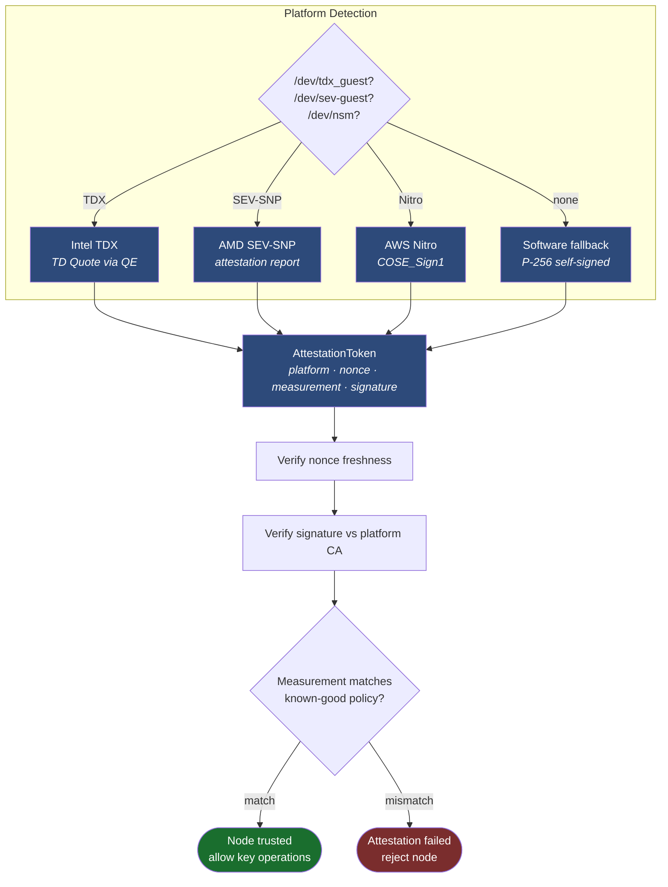

### WebAssembly Plugin System

```mermaid
flowchart LR
    subgraph OPERATOR["Operator"]
        WM["custom_kdf.wasm<br/>+ SHA-256 digest"] --> LOAD["engine.load_plugin()<br/>verify SHA-256 hash<br/>Cranelift JIT compile<br/>validate exports"]
    end

    subgraph RUNTIME["Sandboxed Execution"]
        LOAD --> STORE["Store with<br/>PluginState { capabilities }"]
        STORE --> FUEL["Set MAX_FUEL = 100,000<br/>instructions budget"]
        FUEL --> EXEC["craton_execute(input_ptr, len)<br/>→ output_len"]
    end

    subgraph HOSTABI["Host ABI  (capability-gated)"]
        H1["hsm_log(ptr, len)<br/>→ audit log"]
        H2["hsm_sha256(in, len, out)<br/>→ 32-byte digest"]
        H3["(future) hsm_random(out, len)<br/>→ DRBG bytes"]
    end

    EXEC <-->|"linear memory isolation<br/>no host pointer access"| HOSTABI

    style FUEL fill:#4a2d7a,color:#fff
    style HOSTABI fill:#2d4a7a,color:#fff
```

---

## Cluster Architecture

### Transport protocol selection

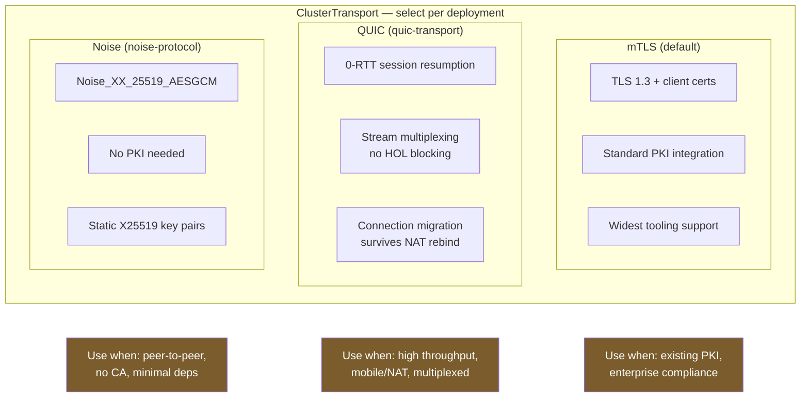

### Raft cluster with multi-transport

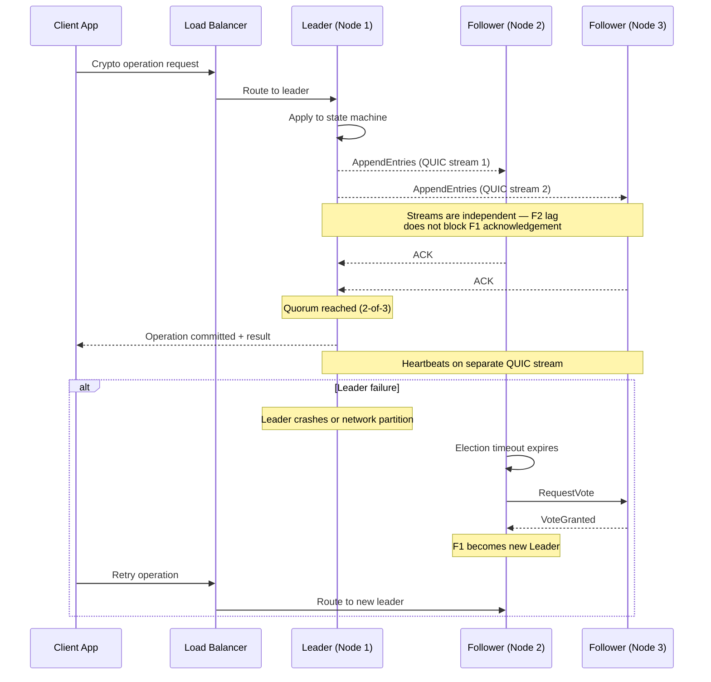

### Key replication and wrapped-key transfer

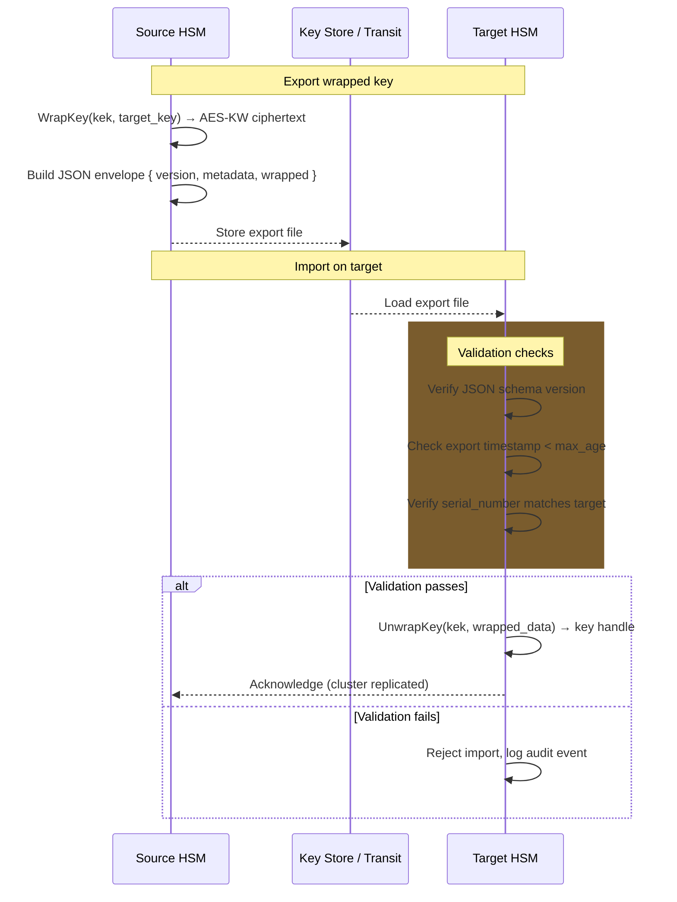

---

## Security Architecture

### Defence-in-depth layers

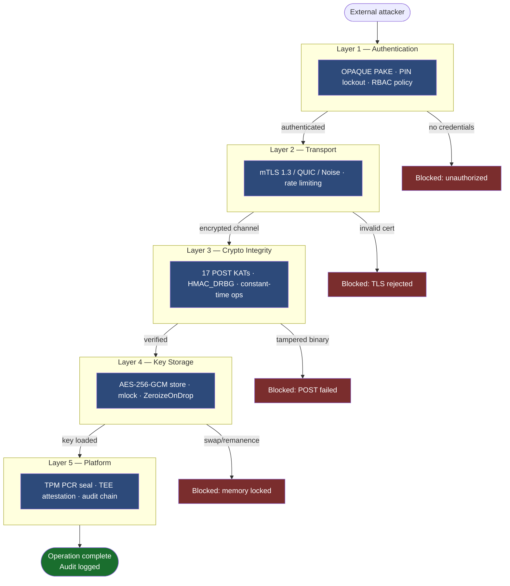

### Zero-knowledge proof subsystem

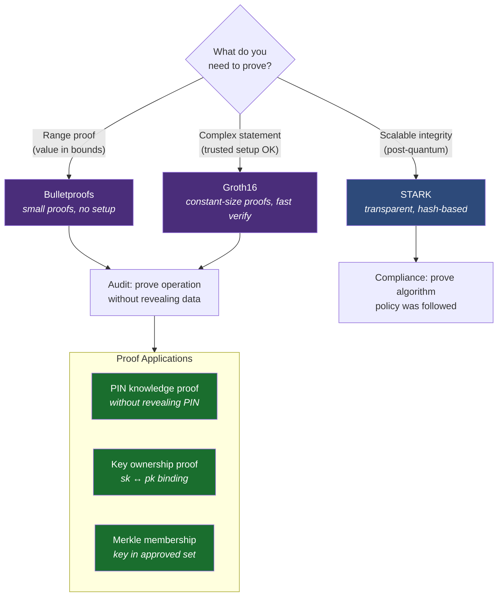

---

## Quick Start

```bash
# Core library only (default RustCrypto backend)
cargo build --release

# Full workspace with gRPC daemon (requires protoc)
cargo build --workspace --release

# Enterprise features
cargo build --release --features "enterprise"

# Post-quantum + hybrid KEM
cargo build --release --features "quantum-resistant,hybrid-kem"

# BLS signatures + STARK proofs
cargo build --release --features "bls-signatures,stark-proofs"

# Full advanced stack (large build — see Feature Flags)
cargo build --release --features "advanced-all"

# Run full test suite (single-threaded — required for PKCS#11 global state)
cargo test -- --test-threads=1
```

### Container deployment

```bash
docker build -t craton-hsm:latest .
kubectl apply -f deploy/helm/
```

### Library integration

```bash
# PKCS#11 dynamic library output
# Linux:   target/release/libcraton_hsm.so
# macOS:   target/release/libcraton_hsm.dylib
# Windows: target/release/craton_hsm.dll

export PKCS11_MODULE_PATH=/path/to/libcraton_hsm.so
pkcs11-tool --module $PKCS11_MODULE_PATH --list-slots
```

---

## Feature Flags

| Flag | Default | Adds |
|---|---|---|
| `rustcrypto-backend` | ✓ | Pure-Rust classical crypto |
| `awslc-backend` | — | FIPS 140-3 validated AWS-LC |
| `fips` | — | Restrict to FIPS-approved algorithms |
| `quantum-resistant` | — | ML-KEM, ML-DSA, SLH-DSA |
| `hybrid-kem` | — | X25519 + ML-KEM-768 dual encapsulation |
| `bls-signatures` | — | BLS12-381 aggregatable signatures (blst) |
| `blake3-hash` | — | BLAKE3 parallel hashing |
| `argon2-kdf` | — | Argon2id memory-hard KDF |
| `voprf-protocol` | — | Verifiable OPRF (RFC 9497) |
| `opaque-auth` | — | OPAQUE PAKE zero-knowledge auth |
| `stark-proofs` | — | STARK proofs via Winterfell |
| `fhe-compute` | — | Fully Homomorphic Encryption (tfhe-rs) ⚠ large |
| `tpm-binding` | — | TPM 2.0 PCR sealing (requires libtss2) |
| `quic-transport` | — | QUIC cluster transport (quinn) |
| `noise-protocol` | — | Noise_XX cluster transport (snow) |
| `wasm-plugins` | — | WASM plugin engine (wasmtime) ⚠ large |
| `onnx-analytics` | — | ONNX ML inference (tract-onnx) |
| `wrapped-keys` | — | JSON / PKCS#8 / PKCS#12 key export |
| `observability` | — | Prometheus metrics + HTTP server |
| `enterprise` | — | `wrapped-keys` + `observability` |
| `advanced-all` | — | All advanced features except fhe-compute, tpm-binding, wasm-plugins |

> ⚠ `fhe-compute`, `tpm-binding`, and `wasm-plugins` are excluded from `advanced-all` due to large compile-time footprint. Enable individually when needed.

---

## Feature Matrix

| Capability | Crate / Algorithm | Status |
|---|---|---|
| **PKCS#11 v3.0 C ABI** | 70+ `#[no_mangle]` functions | ✅ Complete |
| **RSA · ECDSA · EdDSA** | rsa, p256/p384, ed25519-dalek | ✅ Complete |
| **AES-GCM/CBC/CTR/KW** | aes-gcm, cbc, ctr, aes-kw | ✅ Complete |
| **SHA-1/2/3 · HMAC** | sha1/2/3, hmac | ✅ Complete |
| **BLAKE3** | blake3 | ✅ Feature-gated |
| **Argon2id KDF** | argon2 | ✅ Feature-gated |
| **SP 800-90A HMAC_DRBG** | internal | ✅ Complete |
| **ML-KEM 512/768/1024** | ml-kem 0.3 (FIPS 203) | ✅ Complete |
| **ML-DSA 44/65/87** | ml-dsa 0.1 (FIPS 204) | ✅ Complete |
| **SLH-DSA** | slh-dsa 0.2 (FIPS 205) | ✅ Complete |
| **Hybrid KEM** | x25519-dalek + ml-kem | ✅ Feature-gated |
| **BLS12-381** | blst 0.3 (Ethereum ref) | ✅ Feature-gated |
| **VOPRF** | voprf 0.5 (RFC 9497) | ✅ Feature-gated |
| **Groth16 / Bulletproofs ZKP** | ark-groth16, bulletproofs | ✅ Feature-gated |
| **STARK proofs** | winterfell 0.9 | ✅ Feature-gated |
| **FHE** | tfhe 0.10 (Zama) | ✅ Feature-gated |
| **TPM 2.0** | tss-esapi 8 | ✅ Feature-gated |
| **Intel TDX attestation** | ioctl + EAT token | ✅ Linux only |
| **AMD SEV-SNP attestation** | ioctl + EAT token | ✅ Linux only |
| **AWS Nitro attestation** | /dev/nsm + COSE | ✅ Linux only |
| **WASM plugins** | wasmtime 25 + cranelift | ✅ Feature-gated |
| **QUIC transport** | quinn 0.11 | ✅ Feature-gated |
| **Noise Protocol** | snow 0.9 | ✅ Feature-gated |
| **Raft consensus** | internal | ✅ Enabled |
| **Wrapped key I/O** | JSON · PKCS#8 · PKCS#12 | ✅ Feature-gated |
| **Prometheus metrics** | prometheus 0.13, axum | ✅ Feature-gated |
| **Policy engine** | Cedar + OPA/WASM | ✅ Feature-gated |
| **Threshold FROST** | frost-ristretto255, vsss-rs | ✅ Feature-gated |
| **FIPS 140-3 POST** | 17 self-tests (16 KATs) | ✅ Always-on |
| **SP 800-57 key lifecycle** | pre-activation → compromised | ✅ Complete |
| **ONNX anomaly detection** | tract-onnx 0.21 | ✅ Feature-gated |
| **Fork safety** | libc pid detection | ✅ Unix |

---

## System Architecture

### Component layout

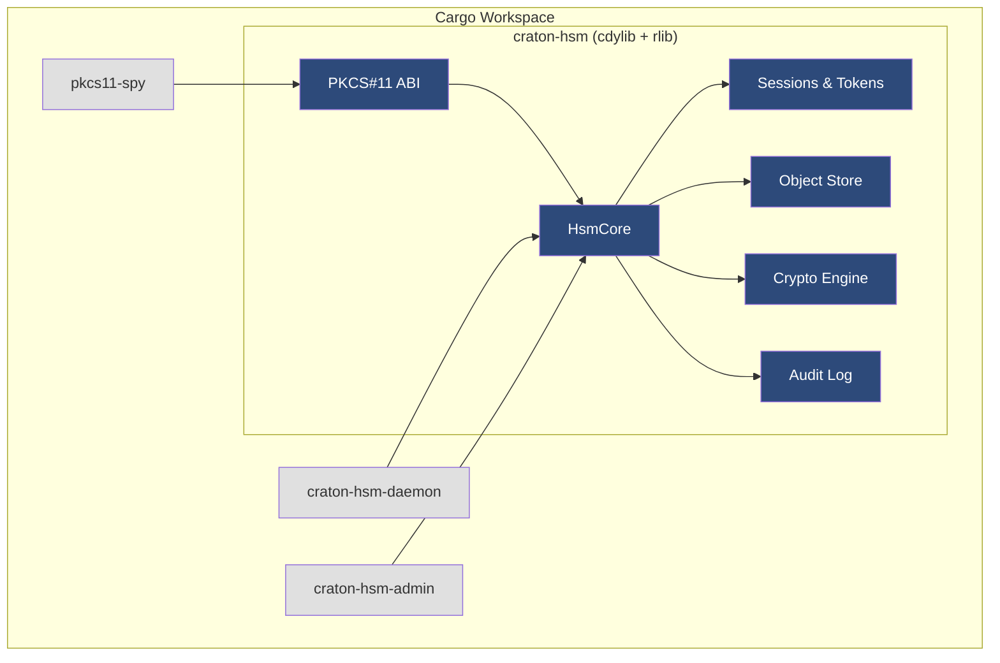

### Data flow for a typical operation

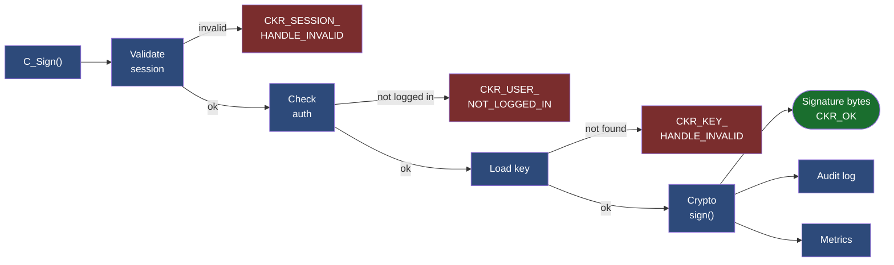

---

## Performance

| Area | Improvement | Mechanism |
|---|---|---|
| RSA operations | 15–25% faster | `Arc<RsaPrivateKey>` in-memory cache |
| Session dispatch | 5–10% faster | Thread-local caching, reduced lock contention |
| Signature serialisation | 3–5% faster | Stack-allocated buffers, zero-copy |
| BLS batch verify | O(1) pairings for n triples | Miller-loop batching via blst |
| Cluster reconnect | 0-RTT on QUIC | quinn session resumption |
| STARK verification | ~1 ms regardless of N | FRI polynomial commitment |
| Key derivation | memory-hard | Argon2id (replaces PBKDF2 for new tokens) |
| Hashing throughput | 3× SHA-256 | BLAKE3 parallel tree |

---

## Standards Compliance

| Standard | Coverage |
|---|---|
| PKCS#11 v3.0 | 70+ C ABI functions, all major mechanisms |
| FIPS 203 (ML-KEM) | All three parameter sets |
| FIPS 204 (ML-DSA) | All three parameter sets |
| FIPS 205 (SLH-DSA) | SHA2-128s, SHA2-256s |
| SP 800-90A | HMAC_DRBG with prediction resistance |
| SP 800-57 | Full key lifecycle state machine |
| FIPS 140-3 Level 1 | Technical requirements implemented; not CMVP-validated |
| RFC 9497 | VOPRF (verifiable oblivious PRF) |
| IETF EAT | Entity Attestation Token output from attestation module |
| Noise Protocol | XX_25519_AESGCM_SHA256 cluster transport |

---

## Documentation

- [Documentation Index](docs/README.md)
- [Installation Guide](docs/install.md)
- [API Reference](docs/api-reference.md)
- [Configuration Reference](docs/configuration-reference.md)
- [Architecture Overview](docs/architecture.md)
- [Security Model](docs/security-model.md)
- [FIPS Gap Analysis](docs/fips-gap-analysis.md)
- [Operator Runbook](docs/operator-runbook.md)
- [Troubleshooting](docs/troubleshooting.md)
- [Examples](docs/examples.md)
- [Migration Guide](docs/migration-guide.md)
- [Benchmarks](docs/benchmarks.md)
- [Tested Platforms](docs/tested-platforms.md)
- [Changelog](CHANGELOG.md)
- [Roadmap](ROADMAP.md)

---

## Disclaimer

**Craton HSM is NOT FIPS 140-3 certified.** While the codebase implements FIPS 140-3 Level 1 technical requirements (POST KATs, pairwise consistency tests, approved algorithms), it has not undergone CMVP validation. See `docs/fips-gap-analysis.md`.

## License

Copyright 2026 Craton Software Company. Licensed under the [Apache License, Version 2.0](LICENSE).
