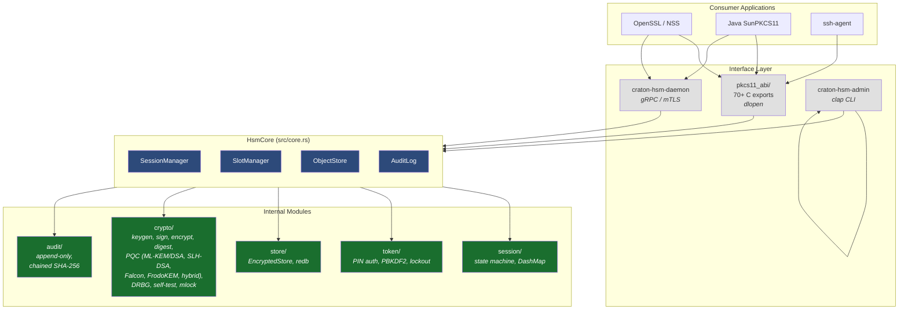
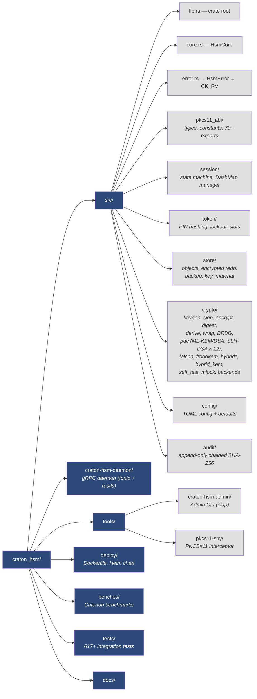
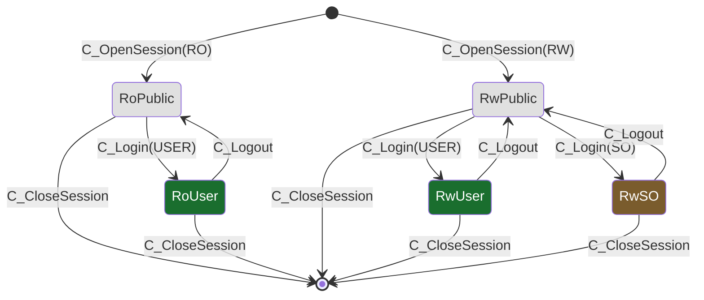
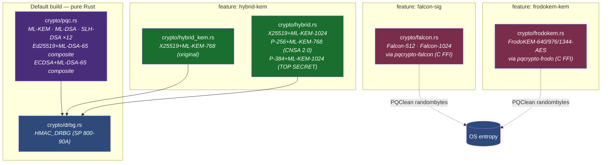
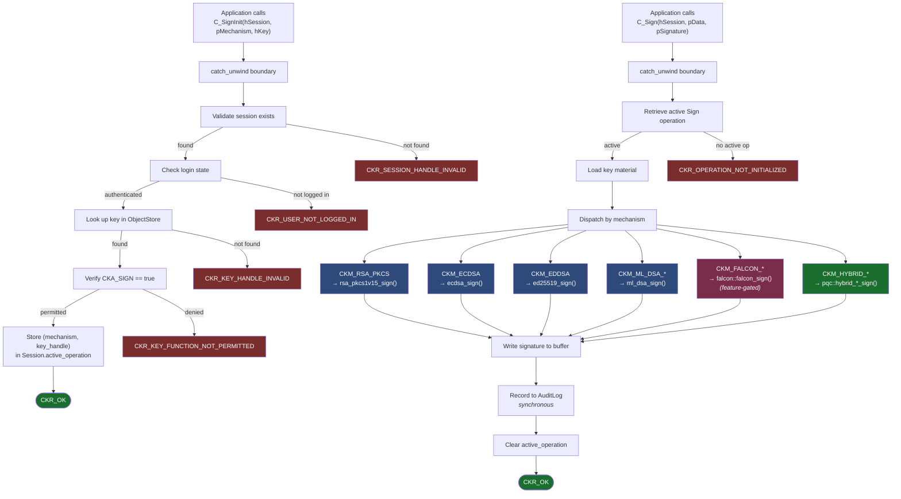
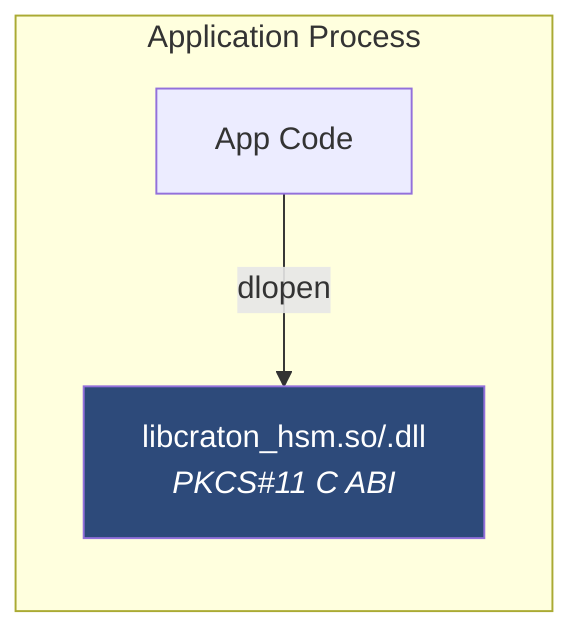
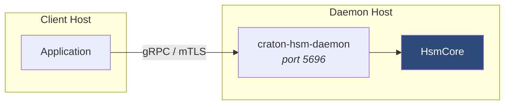
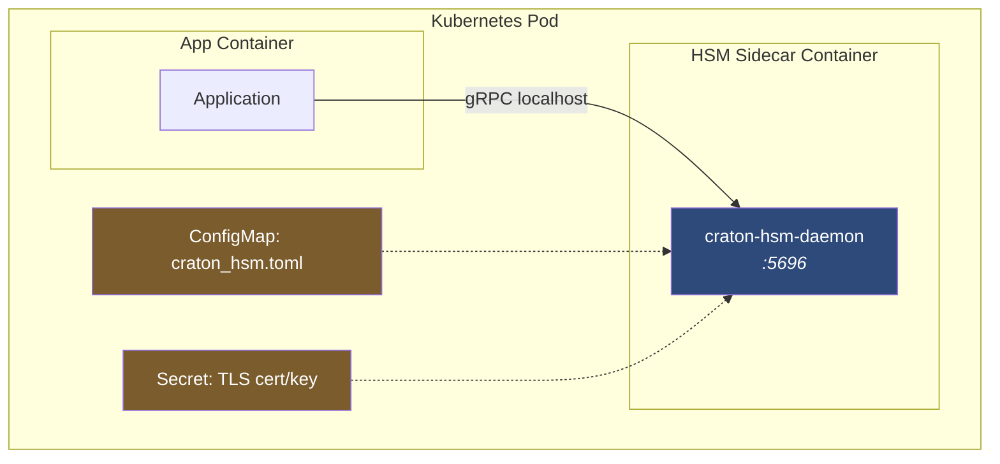
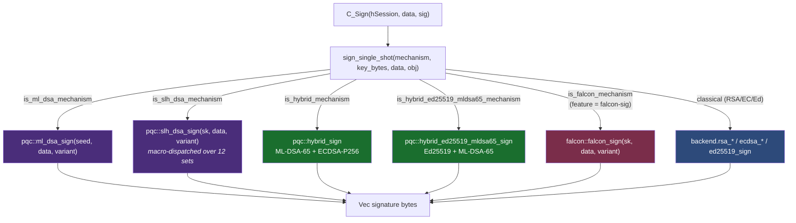

# Craton HSM Architecture

## Overview

Craton HSM is a software HSM (Hardware Security Module emulator) that exposes a PKCS#11 v3.0-compliant C ABI. It is written entirely in Rust to leverage the language's memory safety and concurrency guarantees. The module can be consumed three ways: as a dynamically loaded library, over gRPC, or via the admin CLI.

## High-Level Module Diagram



## Source Layout



## Core Components

### HsmCore (`src/core.rs`)

The central struct holding all managers. All three consumer interfaces (C ABI, gRPC daemon, admin CLI) operate against the same `HsmCore` instance.

```rust
pub struct HsmCore {
    pub(crate) slot_manager: SlotManager,
    pub(crate) session_manager: SessionManager,
    pub(crate) object_store: ObjectStore,
    pub(crate) audit_log: AuditLog,
    pub(crate) crypto_backend: Arc<dyn CryptoBackend>,
    pub(crate) drbg: Mutex<HmacDrbg>,    // SP 800-90A HMAC_DRBG
    pub(crate) algorithm_config: AlgorithmConfig,
}
```

For the C ABI path, `HsmCore` lives inside a `Mutex<Option<Arc<HsmCore>>>` that is initialized during `C_Initialize` and reset to `None` during `C_Finalize`, allowing re-initialization per the PKCS#11 spec.

### PKCS#11 C ABI (`src/pkcs11_abi/`)

Exports 70+ `#[no_mangle] pub extern "C"` functions matching the PKCS#11 v3.0 specification. Every function is wrapped in `catch_unwind` to prevent Rust panics from crossing the FFI boundary (which would be undefined behavior).

All `unsafe` code is confined to this module and follows four documented patterns:
1. Dereferencing caller-provided output pointers
2. Constructing slices from (pointer, length) pairs
3. Reading `CK_MECHANISM` through a raw pointer
4. Casting `CK_C_INITIALIZE_ARGS`

### Session State Machine (`src/session/`)

Five PKCS#11-compliant session states with enforced transitions:



Sessions are stored in a `DashMap<CK_SESSION_HANDLE, Session>` for lock-free concurrent access.

### Token & PIN Authentication (`src/token/`)

- PINs hashed with PBKDF2-HMAC-SHA256 (600,000 iterations, random salt)
- Comparison uses `subtle::ConstantTimeEq` (timing-attack resistant)
- Brute-force protection: configurable lockout after N failed attempts
- SO can unlock a locked user PIN

### Object Store (`src/store/`)

Two storage backends:
1. **In-memory** (`ObjectStore`): fast, volatile, used by default
2. **Encrypted persistent** (`EncryptedStore`): redb database with per-object AES-256-GCM encryption and file-level locking

Objects follow the PKCS#11 attribute model with enforcement of:
- `CKA_SENSITIVE` / `CKA_EXTRACTABLE` for key export control
- `CKA_PRIVATE` for visibility filtering based on login state
- Permission attributes (`CKA_ENCRYPT`, `CKA_SIGN`, etc.)
- `CKA_START_DATE` / `CKA_END_DATE` for date-based key lifecycle (SP 800-57)

### Key Lifecycle (`src/store/object.rs`)

SP 800-57-compliant key lifecycle states with automatic date-based transitions:

| State | Permitted Operations |
|-------|---------------------|
| **PreActivation** | None (key not yet at start_date) |
| **Active** | All permitted operations |
| **Deactivated** | Verify, decrypt, unwrap only (past end_date) |
| **Compromised** | None (manually marked) |
| **Destroyed** | Handle invalid |

Lifecycle checks are enforced in `C_SignInit`, `C_VerifyInit`, `C_EncryptInit`, and `C_DecryptInit`.

### DRBG (`src/crypto/drbg.rs`)

SP 800-90A HMAC_DRBG using HMAC-SHA256:
- Seeded from OS CSPRNG (`OsRng`)
- Prediction resistance: fresh entropy on every generate call
- Continuous health test: compares consecutive outputs (SP 800-90B)
- Reseed interval: 2^48 requests
- All key generation (RSA, EC, Ed25519, AES) routed through DRBG via `DrbgRng` adapter
- Per-key AES-GCM encryption counters (2^31 limit per key, tracked via SHA-256 key hash)

### Crypto Engine (`src/crypto/`)

60+ mechanisms across 8 categories (PQC counts vary by enabled features):

| Category | Algorithms |
|----------|-----------|
| Asymmetric keygen | RSA-2048/3072/4096, ECDSA P-256/P-384, Ed25519 |
| Signing | RSA PKCS#1 v1.5, RSA-PSS, ECDSA, Ed25519, HMAC |
| Encryption | AES-GCM, AES-CBC, AES-CTR, RSA-OAEP |
| Digest | SHA-1, SHA-256, SHA-384, SHA-512, SHA3-256/384/512 |
| Key derivation | ECDH (P-256, P-384) |
| Key wrapping | AES Key Wrap (RFC 3394) |
| Post-quantum (default) | ML-KEM-512/768/1024, ML-DSA-44/65/87, SLH-DSA (all 12 FIPS 205 parameter sets) |
| Post-quantum (feature-gated) | Falcon-512/1024 (`falcon-sig`), FrodoKEM-640/976/1344-AES (`frodokem-kem`) |
| Hybrid | X25519/P-256/P-384 + ML-KEM (`hybrid-kem`); ECDSA-P256+ML-DSA-65, Ed25519+ML-DSA-65 (default) |

#### PQC module layout



Pure-Rust PQC (FIPS 203/204/205) routes all key generation and ML-KEM encapsulation through the SP 800-90A HMAC_DRBG. Falcon and FrodoKEM delegate randomness to PQClean's internal `randombytes` because those crates expose no RNG-injection hook; this is documented as an upstream limitation in [`docs/future-work-guide.md`](future-work-guide.md).

### Audit Log (`src/audit/`)

Append-only log with tamper-evident chained SHA-256 hashes:

```
Entry[n].previous_hash = SHA-256(Entry[n-1])
```

Any modification, deletion, or reordering breaks the chain. Events are recorded synchronously before the PKCS#11 function returns (not fire-and-forget).

### FIPS 140-3 POST (`src/crypto/self_test.rs`)

17 self-tests (software integrity check + 16 KATs) plus continuous RNG health checks run during `C_Initialize`:

| # | Test | Type | Vector Source |
|---|------|------|---------------|
| 0 | Software integrity | HMAC-SHA256 of module binary | §9.4 sidecar `.hmac` file |
| 1 | SHA-256 | Known Answer Test | NIST "abc" |
| 2 | SHA-384 | Known Answer Test | NIST "abc" |
| 3 | SHA-512 | Known Answer Test | NIST "abc" |
| 4 | SHA3-256 | Known Answer Test | NIST "abc" |
| 5 | HMAC-SHA256 | Known Answer Test | RFC 4231 TC2 |
| 6 | HMAC-SHA384 | Known Answer Test | RFC 4231 TC2 |
| 7 | HMAC-SHA512 | Known Answer Test | RFC 4231 TC2 |
| 8 | AES-256-GCM | Encrypt/Decrypt roundtrip + known-answer decrypt | Fixed key |
| 9 | AES-256-CBC | Known Answer Test (hardcoded expected ciphertext) | Fixed key/IV |
| 10 | AES-256-CTR | Known Answer Test (hardcoded expected ciphertext) | Fixed key/IV |
| 11 | RSA 2048 PKCS#1 v1.5 | Sign/Verify roundtrip | Generated key |
| 12 | ECDSA P-256 | Sign/Verify roundtrip | Generated key |
| 13 | ML-DSA-44 | Sign/Verify roundtrip | Generated key |
| 14 | ML-KEM-768 | Encapsulate/Decapsulate roundtrip | Generated key |
| 15 | RNG health | Entropy + continuous test | OsRng (SP 800-90B §4.3) |
| 16 | HMAC_DRBG | Known Answer Test | NIST CAVP vector |

If any test fails, `POST_FAILED` is set and all subsequent operations return `CKR_GENERAL_ERROR`. On re-initialization (after `C_Finalize`), `POST_FAILED` is reset and POST re-runs.

Three additional PQC KATs run when their features are enabled (20 tests total with everything on):

| Test | Feature | Vector Source |
|------|---------|---------------|
| SLH-DSA-SHA2-128f | default | Generated key (fast-variant coverage) |
| Falcon-512 | `falcon-sig` | Generated key + detached sign/verify |
| FrodoKEM-640-AES | `frodokem-kem` | Generated key + encap/decap constant-time compare |

Pairwise consistency tests (FIPS 140-3 §9.6) run after every asymmetric keygen — including Falcon, FrodoKEM, all four hybrid KEM variants, and the composite Ed25519+ML-DSA-65 signature. Failure sets `POST_FAILED` just as with the boot-time KATs.

## Data Flow: Sign Operation



## Concurrency Model

- **Sessions**: `DashMap` provides lock-free concurrent reads, per-shard locks on writes
- **Token state**: `parking_lot::RwLock` for PIN/login state
- **Object store**: `parking_lot::RwLock` protecting the object map
- **Audit log**: `std::sync::Mutex` serializing log writes
- **Global state**: `Mutex<Option<Arc<HsmCore>>>` for initialization/finalization cycles
- **GCM counters**: `LazyLock<DashMap<[u8; 32], AtomicU64>>` for per-key nonce tracking (keyed by SHA-256 of key material)

## Deployment Topology

### In-process (shared library)



### Network daemon (standalone or sidecar)



### Kubernetes sidecar



---

## Storage backend

The default object store is **in-memory** (`DashMap<CK_OBJECT_HANDLE, Arc<RwLock<StoredObject>>>`). Objects are lost on process exit unless the optional **redb** persistent backend is enabled.

When persistence is enabled:
- Each object is serialized and encrypted with **AES-256-GCM** before writing to redb.
- The encryption key is derived from the user PIN via **PBKDF2-HMAC-SHA256** (600,000 iterations).
- There is no separate master KEK — the PIN-derived key is the only encryption key.
- An exclusive file lock (`fs2`) prevents two processes from opening the same database.
- Token re-initialization (`C_InitToken`) destroys all persisted objects.

## Concurrency model

Craton HSM is **single-process, multi-threaded**:
- `DashMap` for lock-free concurrent session and object access
- `parking_lot::RwLock` for per-session state
- `AtomicU64` for session handle and object handle allocation
- `AtomicBool` for FIPS POST gate

Two processes loading `libcraton_hsm.so` independently operate on isolated token state. If persistent storage is enabled, an exclusive file lock (`fs2`) prevents two processes from opening the same database. Multi-process access to the same token is supported through the **gRPC daemon** (`craton-hsm-daemon`), which serializes all operations. See `docs/fork-safety.md` for fork detection and multi-process patterns.

## Crypto backend

All classical cryptographic operations are routed through a **`CryptoBackend` trait** (`src/crypto/backend.rs`), with two implementations:

1. **RustCryptoBackend** (`src/crypto/rustcrypto_backend.rs`) — Default. Uses pure-Rust RustCrypto crates. No external C dependencies.
2. **AwsLcBackend** (`src/crypto/awslc_backend.rs`) — Optional (`--features awslc-backend`). Uses AWS-LC (aws-lc-rs) with FIPS 140-3 validated cryptographic module.

Backend selection is config-driven via `algorithms.crypto_backend` in `craton_hsm.toml` (`"rustcrypto"` or `"awslc"`). The backend is resolved at `C_Initialize` time. PQC operations remain direct calls to dedicated crates — no alternative PQC backends exist yet.

### PQC dispatch in the signing path



See [PQC deep-dive](post-quantum-crypto.md) for full byte layouts, RNG routing, pairwise-test coverage, and storage formats.

### Fork Safety

Craton HSM detects `fork(2)` on Unix by recording the PID during `C_Initialize`. If a child process calls any PKCS#11 function, it receives `CKR_CRYPTOKI_NOT_INITIALIZED` and must re-initialize. See `docs/fork-safety.md` for full details.

### Memory Hardening

Key material is protected at the memory level:
- **`RawKeyMaterial`** wraps `Vec<u8>` with `mlock` on allocation (prevents paging to swap) and `zeroize` + `munlock` on drop
- **Unix**: `libc::mlock` / `libc::munlock`
- **Windows**: `VirtualLock` / `VirtualUnlock` via `windows-sys`
- **Debug output**: Custom `Debug` impl prints `[REDACTED]` for all key bytes
