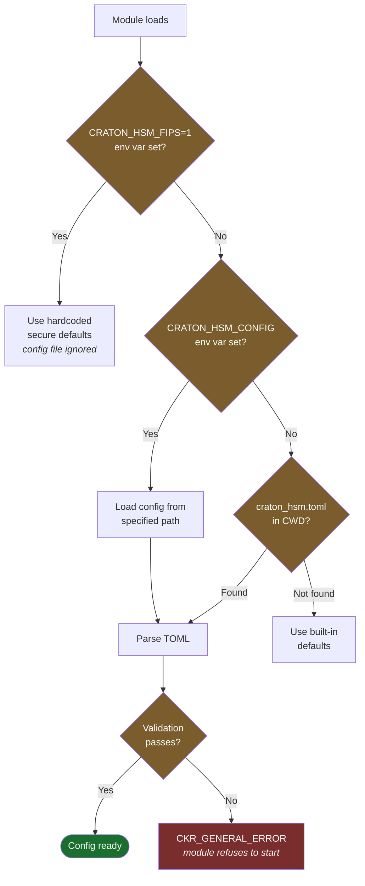

# Configuration Reference

Craton HSM is configured via a TOML file. By default, it looks for `craton_hsm.toml` in the current working directory. Override the path with the `CRATON_HSM_CONFIG` environment variable.

If the config file is not found, secure defaults are used. If the config file exists but cannot be parsed or fails validation, `C_Initialize` returns `CKR_GENERAL_ERROR` (the module refuses to start with potentially misconfigured security parameters).

In FIPS mode (`CRATON_HSM_FIPS=1` or `--features fips`), config files are ignored and hardcoded secure defaults are used.

## Configuration Resolution



### Configuration Validation (v0.9.1)

The following validation rules are enforced on load:
- `storage_path` and `log_path`: must be relative, no `..` traversal, no UNC paths (`\\server\share`), no null bytes
- `pin_min_length` ≥ 4; `pin_max_length` ≥ `pin_min_length`
- `pbkdf2_iterations` ≥ 100,000
- `max_failed_logins`: 3–100 (prevents accidental lockout or brute-force)
- `serial_number`: 1–16 ASCII printable characters
- `slot_count` ≥ 1
- `crypto_backend`: must be `"rustcrypto"` or `"awslc"`
- `log_level`: must be `"all"`, `"crypto"`, `"auth"`, `"admin"`, or `"none"`

## Environment Variables

| Variable | Default | Description |
|----------|---------|-------------|
| `CRATON_HSM_CONFIG` | `craton_hsm.toml` | Path to the configuration file |

## `[token]` — Token & Slot Settings

| Field | Type | Default | Description |
|-------|------|---------|-------------|
| `label` | string | `"Craton HSM Token 0"` | Token display name (returned by `C_GetTokenInfo`) |
| `storage_path` | string | `"craton_hsm_store"` | Path to the redb persistent storage database. Must be relative (no absolute paths, no `..` traversal, no UNC paths). |
| `max_sessions` | integer | `100` | Maximum concurrent PKCS#11 sessions |
| `max_rw_sessions` | integer | `10` | Maximum read-write sessions |
| `persist_objects` | bool | `false` | Persist token objects to disk (AES-256-GCM encrypted) |
| `slot_count` | integer | `1` | Number of virtual slots to expose (must be ≥ 1) |
| `serial_number` | string | `"0000000000000001"` | Token serial number (max 16 chars, ASCII printable) |

## `[security]` — PIN & Authentication

| Field | Type | Default | Description |
|-------|------|---------|-------------|
| `pin_min_length` | integer | `8` | Minimum PIN length in bytes (must be ≥ 4) |
| `pin_max_length` | integer | `64` | Maximum PIN length in bytes (must be ≥ pin_min_length) |
| `max_failed_logins` | integer | `10` | Failed login attempts before PIN lockout (range: 3–100) |
| `pbkdf2_iterations` | integer | `600000` | PBKDF2-HMAC-SHA256 iterations for PIN hashing (must be ≥ 100,000; SP 800-132) |

## `[algorithms]` — Cryptographic Policy

| Field | Type | Default | Description |
|-------|------|---------|-------------|
| `crypto_backend` | string | `"rustcrypto"` | Crypto backend: `"rustcrypto"` (default) or `"awslc"` (requires [craton_hsm-enterprise](https://github.com/craton-co/craton-hsm-core-enterprise)) |
| `fips_approved_only` | bool | `false` | Restrict to FIPS 140-3 approved algorithms only |
| `enable_pqc` | bool | `true` | Enable post-quantum mechanisms (ML-KEM, ML-DSA, SLH-DSA) |
| `allow_weak_rsa` | bool | `false` | Allow RSA key sizes below 2048 bits |
| `allow_sha1_signing` | bool | `false` | Allow SHA-1 in signing contexts (deprecated per SP 800-131A) |

### FIPS Approved Mode

When `fips_approved_only = true`:

**Allowed**: RSA (>=2048), ECDSA (P-256, P-384), AES (GCM/CBC/CTR), SHA-256/384/512, SHA3-256/384/512, ECDH, AES Key Wrap

**Blocked**: EdDSA (Ed25519), SHA-1 signing, all PQC mechanisms, RSA < 2048

See [FIPS Mode Guide](fips-mode-guide.md) for deployment details.

## `[audit]` — Audit Logging

| Field | Type | Default | Description |
|-------|------|---------|-------------|
| `enabled` | bool | `true` | Enable tamper-evident audit logging |
| `log_path` | string | `"craton_hsm_audit.jsonl"` | Path to the append-only audit log file |
| `log_level` | string | `"all"` | Log verbosity: `"all"`, `"crypto"`, `"auth"`, `"admin"`, or `"none"` |

## `[daemon]` — gRPC Server (craton-hsm-daemon only)

| Field | Type | Default | Description |
|-------|------|---------|-------------|
| `bind` | string | `"127.0.0.1:5696"` | gRPC listen address and port |
| `tls_cert` | string | *(none)* | Path to PEM certificate file for mutual TLS |
| `tls_key` | string | *(none)* | Path to PEM private key file for mutual TLS |

## Example: Default Configuration

```toml
[token]
label = "Craton HSM Token 0"
storage_path = "craton_hsm_store"
max_sessions = 100
max_rw_sessions = 10
persist_objects = false
slot_count = 1

[security]
pin_min_length = 8
pin_max_length = 64
max_failed_logins = 10
pbkdf2_iterations = 600000

[algorithms]
crypto_backend = "rustcrypto"
fips_approved_only = false
enable_pqc = true
allow_weak_rsa = false
allow_sha1_signing = false

[audit]
enabled = true
log_path = "craton_hsm_audit.jsonl"
log_level = "all"
```

## Example: FIPS 140-3 Deployment

```toml
[algorithms]
crypto_backend = "awslc"
fips_approved_only = true
enable_pqc = false
allow_weak_rsa = false
allow_sha1_signing = false

[security]
pbkdf2_iterations = 600000
max_failed_logins = 5

[audit]
enabled = true
log_level = "all"
```

## Example: High-Session Server

```toml
[token]
max_sessions = 1000
max_rw_sessions = 100
persist_objects = true
slot_count = 4
```
