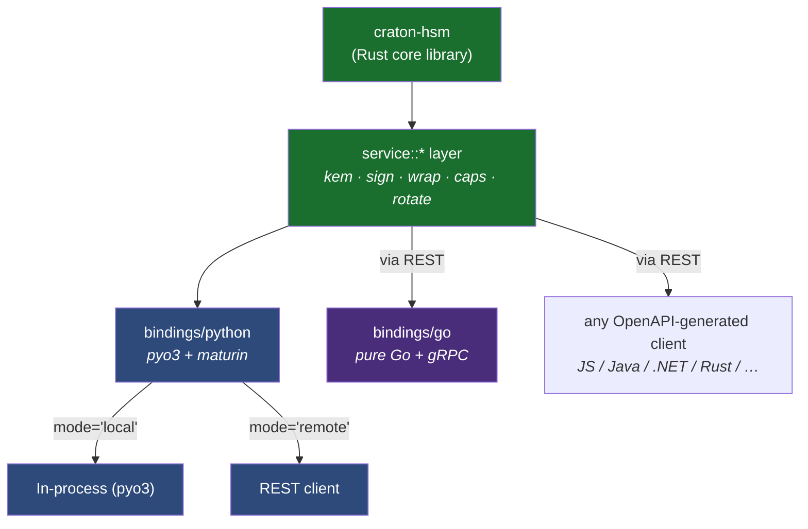

# Language Bindings

Craton HSM exposes PQ-safe operations to multiple language ecosystems.
Each binding sits on top of the same `service::*` layer that backs the
PKCS#11 C ABI and the REST gateway, so behaviour is consistent.



## Python (`bindings/python`)

Dual-mode: local (pyo3 extension) or remote (REST client).

### Install from source

```bash
cd bindings/python
pip install maturin
maturin develop --features "hybrid-kem,falcon-sig"
```

### Usage

```python
from craton_hsm import HsmClient

# In-process — private keys stay in the same process
c = HsmClient(mode="local")
print(c.capabilities()["slh_dsa_variants"])   # 12 parameter sets

sig = c.sign(handle=17, mechanism="CKM_ML_DSA_65", data=b"hello")
assert c.verify(handle=18, mechanism="CKM_ML_DSA_65",
                data=b"hello", signature=sig)

# Or remote — same API, just swap the transport
c2 = HsmClient(
    mode="remote",
    base_url="https://hsm.example.com:9443",
    token="<JWT>",
    client_cert=("/etc/tls/client.crt", "/etc/tls/client.key"),
    verify="/etc/tls/ca.crt",
)
```

See `bindings/python/README.md` for the full mechanism list.

## Go (`bindings/go`)

Pure-Go gRPC client. Talks to `craton-hsm-daemon` — no cgo, no
dependency on the compiled Rust core library.

### Install

```bash
go get github.com/craton-co/craton-hsm-go@latest
```

### Usage

```go
import hsm "github.com/craton-co/craton-hsm-go"

client, _ := hsm.New("hsm.example.com:9443",
    hsm.WithMTLS("cert.pem", "key.pem", "ca.pem"),
    hsm.WithJWT(jwtToken),
)
defer client.Close()

sig, _ := client.Sign(ctx, keyHandle, hsm.CKM_ML_DSA_65, []byte("hello"))

ct, ss, _ := client.Encapsulate(ctx, pubHandle, hsm.CKM_HYBRID_P256_MLKEM768)
ss2, _ := client.Decapsulate(ctx, privHandle, hsm.CKM_HYBRID_P256_MLKEM768, ct)
// bytes.Equal(ss, ss2) == true
```

## Choosing a transport

| Need | Pick |
|---|---|
| Lowest latency, one process | Python local |
| Polyglot stack, central HSM | REST (curl / OpenAPI-generated clients) |
| Go service | Go gRPC client |
| C / C++ / PKCS#11-aware | Use the PKCS#11 C ABI + vendor extensions directly |

## See also

- [PKCS#11 Vendor Extensions](vendor-extensions.md)
- [REST API](rest-api.md)
- [Post-Quantum Cryptography](post-quantum-crypto.md)
