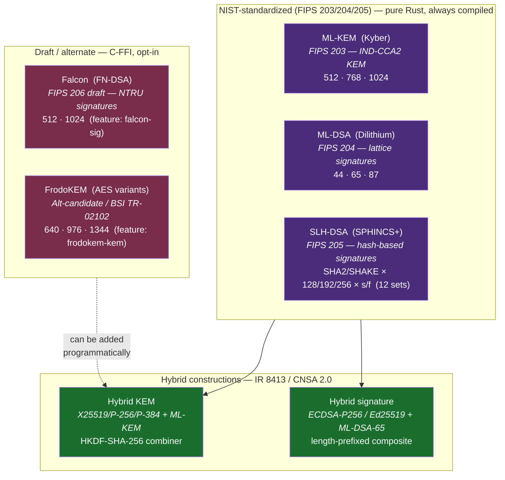
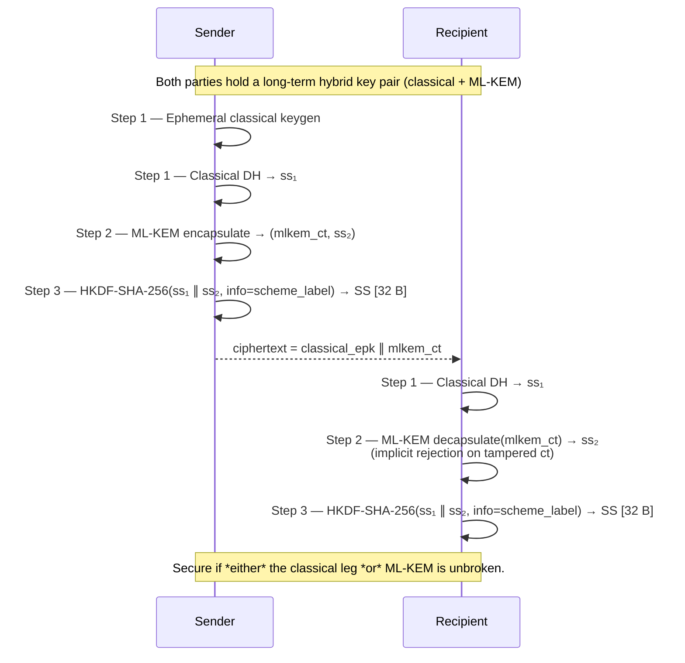
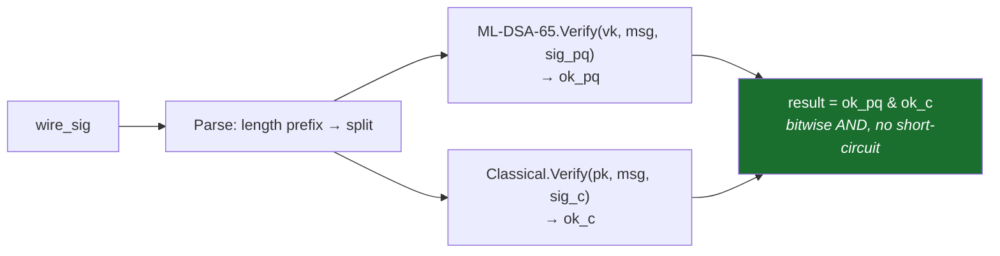
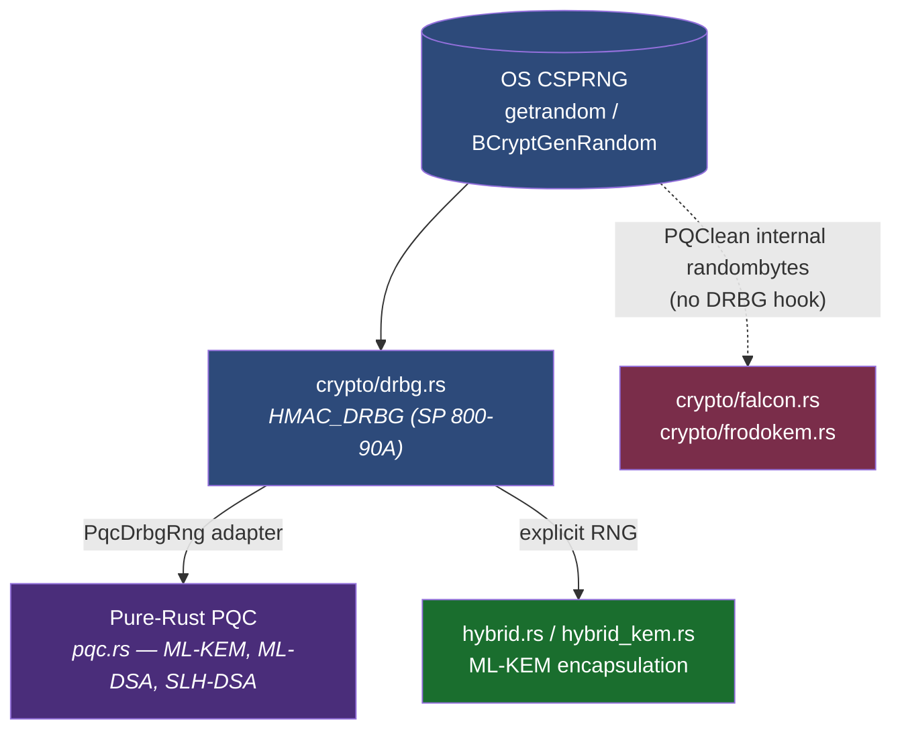
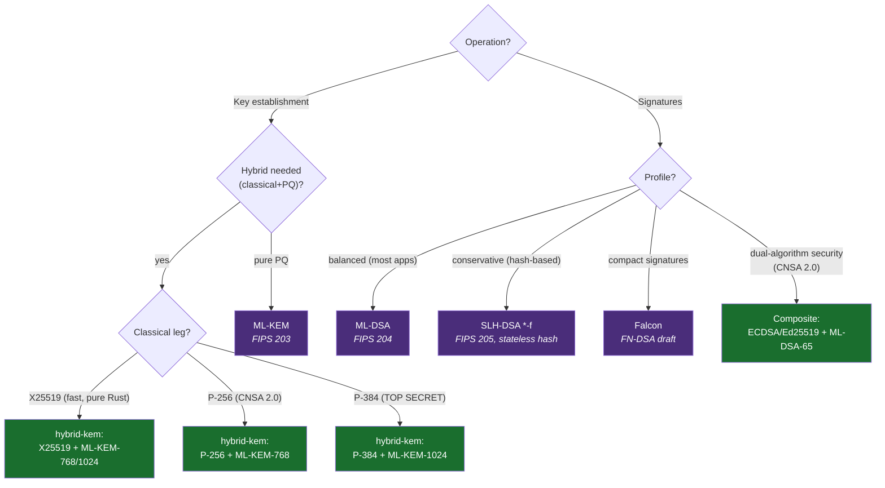

# Post-Quantum Cryptography

This document is the deep-dive on Craton HSM's post-quantum surface: which algorithms are implemented, how to enable them, what the PKCS#11 and byte-level contracts look like, and the caveats worth knowing before wiring any of this into a production system.

For the TL;DR matrix, see the **Post-quantum algorithm matrix** section of the top-level [README](../README.md#post-quantum-algorithm-matrix). For architectural context (modules, dispatch, self-tests), see [`architecture.md`](architecture.md#pqc-module-layout).

> **Not FIPS-validated.** None of the PQC algorithms below carry CMVP certificates. FIPS-mode deployments (`[algorithms] fips_approved_only = true` in `craton_hsm.toml`) reject every PQC mechanism. See [FIPS gap analysis](fips-gap-analysis.md).

---

## Algorithm landscape



---

## Algorithm matrix (exhaustive)

| Category | Variant | NIST claimed security | Public key | Private key | Ciphertext / Sig | Shared secret | Feature flag |
|----------|---------|----------------------:|-----------:|------------:|-----------------:|--------------:|--------------|
| **ML-KEM** | 512 | I (~AES-128) | 800 B | 64 B seed | 768 B | 32 B | *default* |
| | 768 | III (~AES-192) | 1184 B | 64 B seed | 1088 B | 32 B | *default* |
| | 1024 | V (~AES-256) | 1568 B | 64 B seed | 1568 B | 32 B | *default* |
| **ML-DSA** | 44 | II | 1312 B | 32 B seed | 2420 B | — | *default* |
| | 65 | III | 1952 B | 32 B seed | 3309 B | — | *default* |
| | 87 | V | 2592 B | 32 B seed | 4627 B | — | *default* |
| **SLH-DSA SHA2** | 128s / 128f | I / I | 32 B | 64 B | 7856 / 17088 B | — | *default* |
| | 192s / 192f | III / III | 48 B | 96 B | 16224 / 35664 B | — | *default* |
| | 256s / 256f | V / V | 64 B | 128 B | 29792 / 49856 B | — | *default* |
| **SLH-DSA SHAKE** | 128s / 128f / 192s / 192f / 256s / 256f | I – V | same as SHA2 | same | same | — | *default* |
| **Falcon** | 512 | I | 897 B | 1281 B | ≤ 752 B (variable) | — | `falcon-sig` |
| | 1024 | V | 1793 B | 2305 B | ≤ 1462 B (variable) | — | `falcon-sig` |
| **FrodoKEM-AES** | 640 | I | 9616 B | 19888 B | 9720 B | 16 B | `frodokem-kem` |
| | 976 | III | 15632 B | 31296 B | 15744 B | 24 B | `frodokem-kem` |
| | 1344 | V | 21520 B | 43088 B | 21632 B | 32 B | `frodokem-kem` |

Byte sizes are the on-wire / in-store serialization, not the in-memory object size.

---

## Hybrid KEM construction

All four hybrid KEMs — including the original X25519+ML-KEM-768 — share the same three-step shape. Only the classical primitive, ML-KEM parameter set, and HKDF `info` label vary. Using a distinct label per scheme provides domain separation so that a ciphertext from one variant cannot be reinterpreted as another.



### Wire formats

| Variant | Classical leg bytes | ML-KEM part | Combined ciphertext | Secret-key storage (runtime) |
|---------|--------------------:|:-----------:|--------------------:|-----------------------------:|
| X25519+ML-KEM-768 | 32 (X25519 static pk) | 1088 (ct) | 1120 B | 32 (sk) + 32 (eph) bytes held in `StaticSecret` + `DecapsulationKey` |
| X25519+ML-KEM-1024 | 32 | 1568 (ct) | 1600 B | 32 (sk) + 64 (seed) = 96 B on disk |
| P-256+ML-KEM-768 | 65 (SEC1 uncompressed) | 1088 | 1153 B | 32 (scalar) + 64 (seed) = 96 B on disk |
| P-384+ML-KEM-1024 | 97 (SEC1 uncompressed) | 1568 | 1665 B | 48 (scalar) + 64 (seed) = 112 B on disk |

### HKDF labels (domain separation)

| Scheme | Label string |
|--------|--------------|
| X25519 + ML-KEM-768 | `CRATON-HYBRID-X25519-MLKEM768-V1` |
| X25519 + ML-KEM-1024 | `CRATON-HYBRID-X25519-MLKEM1024-V1` |
| P-256  + ML-KEM-768  | `CRATON-HYBRID-P256-MLKEM768-V1` |
| P-384  + ML-KEM-1024 | `CRATON-HYBRID-P384-MLKEM1024-V1` |

`CRATON-HYBRID-*-V1` is the current version tag; any change to the KDF, combiner, or wire layout would bump this to `V2`.

---

## Composite signature construction

Both composite signature mechanisms (ECDSA-P256+ML-DSA-65 and Ed25519+ML-DSA-65) use the same wire layout:

```
[BE u32: len(sig_pq)] [sig_pq (ML-DSA-65)] [sig_classical]
```

Signing concatenates the two signatures. Verification parses the length prefix, runs both verify calls unconditionally (to avoid timing leaks that would reveal which leg failed), and combines the results with a bitwise AND:



Composite-signature private keys are stored as the concatenation `[classical_sk ∥ ML-DSA-65_seed]`, and public keys as `[classical_pk ∥ ML-DSA-65_vk]`. The PKCS#11 `CKK_*` key type is `CKK_ML_DSA` for both composites — the mechanism alone disambiguates the classical leg.

---

## RNG routing

Craton HSM aims to route all secret-bearing randomness through the SP 800-90A HMAC_DRBG (see [`drbg.rs`](../src/crypto/drbg.rs)), which adds continuous health testing and prediction resistance on top of the OS CSPRNG.



**Caveat.** The `pqcrypto-falcon` and `pqcrypto-frodo` crates wrap PQClean reference code, which calls its own `randombytes` internally. There is no public hook to inject an external RNG. Falcon key generation and FrodoKEM key generation therefore bypass the DRBG and read directly from the OS entropy source. This is documented as an upstream limitation — if Craton HSM's FIPS posture ever requires DRBG routing for these too, the path forward is either (a) wait for a RustCrypto-native Falcon (`fn-dsa`) to stabilize, or (b) maintain a fork of PQClean with an RNG-injection API. Both are tracked in [`future-work-guide.md`](future-work-guide.md).

---

## Storage and key-type (`CKK_*`) mapping

Every PQC key goes through the same `StoredObject` path as RSA/EC keys. The `CKK_*` constant identifies the family; the mechanism used at keygen time disambiguates variants and hybrid composites.

| Algorithm | `CKK_*` | `key_material` (private key bytes) | `public_key_data` |
|-----------|---------|------------------------------------|-------------------|
| ML-KEM | `CKK_ML_KEM` (0x80000001) | 64-byte seed | Encapsulation-key bytes |
| ML-DSA | `CKK_ML_DSA` (0x80000002) | 32-byte seed | Verification-key bytes |
| SLH-DSA | `CKK_SLH_DSA` (0x80000003) | Full signing-key bytes | Full verifying-key bytes |
| Falcon | `CKK_FALCON` (0x80000004) | Full PQClean secret-key bytes | Full public-key bytes |
| FrodoKEM | `CKK_FRODO_KEM` (0x80000005) | Full PQClean secret-key bytes | Full public-key bytes |
| Hybrid KEM (any variant) | `CKK_ML_KEM` | `[classical_sk ∥ mlkem_seed]` | `[classical_pk ∥ mlkem_ek]` |
| Composite signature | `CKK_ML_DSA` | `[classical_sk ∥ mldsa65_seed]` | `[classical_pk ∥ mldsa65_vk]` |

When `StoredObject.sensitive = true` and `extractable = false` (the default for private keys), `CKA_VALUE` reads return `CKR_ATTRIBUTE_SENSITIVE`. Export is only possible via `C_WrapKey` under an AES-wrap mechanism, which is orthogonal to PQC.

---

## Enabling PQC

### Build-time

```bash
# Default — ML-KEM, ML-DSA, SLH-DSA (all 12 sets), composite signatures.
# Fully pure Rust, no C toolchain required.
cargo build --release

# Add the four hybrid KEM constructions (pure Rust).
cargo build --release --features hybrid-kem

# Add Falcon — requires a C compiler (pqcrypto-falcon → PQClean).
cargo build --release --features falcon-sig

# Add FrodoKEM — requires a C compiler (pqcrypto-frodo → PQClean).
cargo build --release --features frodokem-kem

# Full PQC stack.
cargo build --release --features "hybrid-kem,falcon-sig,frodokem-kem"
```

### Runtime policy

```toml
# craton_hsm.toml
[algorithms]
crypto_backend = "rustcrypto"   # "rustcrypto" | "awslc"
enable_pqc = true               # Set false to hide every PQC mechanism from C_GetMechanismList
fips_approved_only = false      # Set true to strictly enforce FIPS 140-3 algorithms (excludes all PQC)
allow_sha1_signing = false
```

With `enable_pqc = false`, `C_GetMechanismList` omits PQC mechanisms and any call using one returns `CKR_MECHANISM_INVALID`. With `fips_approved_only = true`, the same effect applies (PQC is unconditionally non-FIPS in this project).

---

## Self-tests and pairwise checks

- **Boot-time KATs** — `crypto/self_test.rs` runs a fixed set of Known Answer Tests at every `C_Initialize`. PQC coverage scales with enabled features: ML-DSA-44 and ML-KEM-768 always run; SLH-DSA-SHA2-128f runs always; Falcon-512 runs under `falcon-sig`; FrodoKEM-640-AES runs under `frodokem-kem`.
- **Pairwise consistency** — After every asymmetric keygen the module signs-and-verifies (or encaps-and-decaps) a fixed payload. Failure sets the process-wide `POST_FAILED` flag and every subsequent call returns `CKR_GENERAL_ERROR` until `C_Finalize`/`C_Initialize` restarts the module.
- **Integration tests** — `tests/pqc_phase3.rs`, `tests/pqc_slh_expansion.rs`, `tests/pqc_falcon.rs`, `tests/pqc_frodokem.rs`, `tests/pqc_hybrid_modes.rs`, `tests/pqc_abi_comprehensive.rs`.

Run with:

```bash
# Full PQC test suite (release mode is MUCH faster for SLH-DSA)
RUST_MIN_STACK=67108864 cargo test --release \
  --test pqc_phase3 --test pqc_slh_expansion --test pqc_hybrid_modes \
  --test pqc_falcon --test pqc_frodokem \
  --features "hybrid-kem,falcon-sig,frodokem-kem" \
  -- --test-threads=2
```

`RUST_MIN_STACK` is required because SLH-DSA signing — especially the `_256s` parameter sets — uses a large call stack that exceeds the default Rust test-thread stack.

---

## Choosing a PQC scheme

A quick decision tree:



General guidance:

- **Default**: ML-KEM-768 (KEM) and ML-DSA-65 (signature) — the middle NIST security category, good balance of size/speed.
- **Hybrid KEM**: X25519+ML-KEM-768 is the fastest; P-256/P-384 variants exist for CNSA 2.0 or ECC-only stacks.
- **Composite signatures**: pick when you need assurance that breakage of either leg alone doesn't invalidate the signature. Useful for long-term archival over the quantum transition.
- **SPHINCS+ (SLH-DSA)**: pick when you need hash-based signatures (no reliance on lattice hardness). Prefer the `-f` variants for speed; the `-s` variants produce smaller signatures but are significantly slower to generate.
- **Falcon**: smallest signatures in the FIPS draft family; historically has implementation pitfalls around constant-time floating-point. Require `falcon-sig` + careful threat-model review.
- **FrodoKEM**: the most conservative KEM hardness assumption (plain LWE, not structured lattices). Consider it when diversity from ML-KEM is valuable — e.g., BSI-aligned deployments.

---

## See also

- [`architecture.md`](architecture.md) — modules, dispatch, self-test plumbing
- [`api-reference.md`](api-reference.md) — full PKCS#11 mechanism list including feature-gated entries
- [`configuration-reference.md`](configuration-reference.md) — `[algorithms]` policy options
- [`fips-gap-analysis.md`](fips-gap-analysis.md) — why PQC is excluded in FIPS mode
- [`future-work-guide.md`](future-work-guide.md) — tracked items: pure-Rust Falcon (`fn-dsa`), DRBG injection upstream, PKCS#11 v3.2 `C_EncapsulateKey` / `C_DecapsulateKey`
