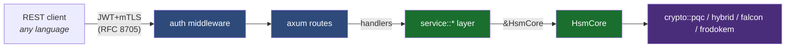

# REST API

The `craton-hsm-rest` crate (workspace member) is an axum-based HTTP/JSON
gateway that exposes every PQ-safe cryptographic operation over HTTPS.
Feature-gated, opt-in — default builds ship without it.

```bash
cargo build --release -p craton-hsm-rest --features hybrid-kem
```

## Architecture



The router is available both as a standalone binary and as a library
surface — `craton_hsm_rest::build_router(Arc<HsmCore>) -> axum::Router`.
The library surface lets you embed the REST handlers inside a larger
axum application or a test harness.

## Authentication — JWT over mTLS (RFC 8705)

Two-factor by default:

1. **mTLS** — the client presents a cert signed by the configured client CA.
   The TLS acceptor computes the SPKI SHA-256 and attaches it as a
   `ClientCertBinding` request extension.
2. **JWT bearer** — `Authorization: Bearer <JWT>`, signature verified
   against the configured JWKS via [`auth::verify_jwt`](../craton-hsm-rest/src/auth.rs).
   Algorithms supported: RS256/384/512, PS256/384/512, ES256/384, EdDSA.
   The verifier enforces `iss`, `aud`, `exp`, `nbf` with configurable
   leeway.

The two factors are bound by RFC 8705: the JWT must carry
`cnf.x5t#S256 = base64url(SHA-256(SubjectPublicKeyInfo(clientCert)))`. If
the thumbprint doesn't match the presented cert's SPKI hash, the request
is rejected with `401 Unauthorized`.

JWKS sources are configured via `RestConfig::jwt::jwks_source`:
- `File { path }` — load once at startup; hot-reload via SIGHUP (roadmap).
- `Url { url }` — periodic refresh (every 60 min by default).

Embedding hosts that want custom auth wiring can call
[`build_router_with_auth`](../craton-hsm-rest/src/router.rs) with a
hand-constructed `AuthRuntime`, bypassing TOML config.

Scopes (OAuth 2.0 `scope` claim, space-separated):

| Scope    | Routes                                              |
|----------|-----------------------------------------------------|
| `sign`   | `POST /v1/keys/{h}/sign`, `POST /v1/hybrid/compose-sign` |
| `verify` | `POST /v1/keys/{h}/verify`, `POST /v1/hybrid/compose-verify` |
| `kem`    | `POST /v1/kems/{h}/encapsulate`, `/decapsulate`     |
| `wrap`   | `POST /v1/wrap`, `POST /v1/unwrap`                  |
| `admin`  | keygen, rotate, destroy                             |
| `attest` | `POST /v1/attest`                                   |

A `CRATON_REST_DEV_AUTH=1` environment variable enables a development
auth path that accepts any `X-Dev-Scopes` header value. Never use this
outside local testing.

## Routes

| Method | Path | Scope | Notes |
|---|---|---|---|
| GET | `/v1/capabilities` | — | Runtime feature snapshot |
| GET | `/v1/openapi.json` | — | OpenAPI 3.1 self-description |
| POST | `/v1/keys/{h}/sign` | `sign` | Any PQC mechanism |
| POST | `/v1/keys/{h}/verify` | `verify` | |
| POST | `/v1/kems/{h}/encapsulate` | `kem` | ML-KEM / FrodoKEM / hybrid |
| POST | `/v1/kems/{h}/decapsulate` | `kem` | |
| POST | `/v1/hybrid/compose-sign` | `sign` | ECDSA+ML-DSA-65, Ed25519+ML-DSA-65 |
| POST | `/v1/hybrid/compose-verify` | `verify` | |
| POST | `/v1/wrap` | `wrap` | `CKM_HYBRID_KEM_WRAP` (needs `hybrid-kem`) |
| POST | `/v1/unwrap` | `wrap` | |
| GET | `/healthz` | — | Liveness |
| GET | `/readyz` | — | Readiness |

## OpenAPI

The spec is generated by utoipa and served at `/v1/openapi.json`.
Generators (openapi-generator, swagger-codegen) can be pointed at that
endpoint to produce first-class clients in 50+ languages.

```bash
curl -sk https://hsm.example.com:9443/v1/openapi.json | jq .
```

## Example: sign under ML-DSA-65

```bash
export JWT=$(issue-jwt --scope="sign verify" --bind-cert /etc/tls/client.crt)

curl --cacert /etc/tls/ca.pem \
     --cert /etc/tls/client.crt --key /etc/tls/client.key \
     -H "Authorization: Bearer $JWT" \
     -H "Content-Type: application/json" \
     -d '{"mechanism":"CKM_ML_DSA_65","data_b64":"aGVsbG8"}' \
     https://hsm.example.com:9443/v1/keys/17/sign
```

Returns:

```json
{
  "signature_b64": "GZrOs...<3309 bytes base64url>...",
  "signature_len": 3309,
  "mechanism": "CKM_ML_DSA_65"
}
```

## Error model — RFC 7807

All errors conform to RFC 7807 ProblemDetails with a PKCS#11-aligned
`type` code:

```json
{
  "type": "CKR_MECHANISM_INVALID",
  "title": "Invalid mechanism",
  "status": 400,
  "detail": "mechanism 0x00000123 not supported",
  "instance": "b5e4a1b7-…"   // X-Request-Id echoed
}
```

## See also

- [PKCS#11 Vendor Extensions](vendor-extensions.md) — the same operations
  over the in-process C ABI
- [Language Bindings](language-bindings.md)
