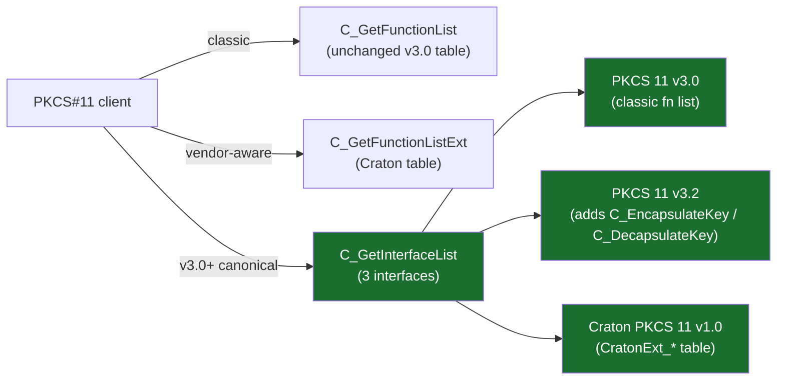

# PKCS#11 Vendor Extensions

Enable the `vendor-ext` Cargo feature to compile Craton HSM's optional
PKCS#11 extensions: a native v3.2-style KEM ABI, a Craton vendor function
table with PQC-specific helpers, and the `CKM_HYBRID_KEM_WRAP` mechanism.
The default (non-feature) build is unchanged — no new symbols appear and
the PKCS#11 v3.0 contract is fully preserved.

```bash
cargo build --release --features "vendor-ext,hybrid-kem"
```

## Discovery

Clients have three increasingly-preferred ways to reach the extensions:



Additionally, a `CK_C_INITIALIZE_ARGS` whose `pReserved` points at a
`CK_CRATON_EXT_INIT_OUT` buffer with magic `0x43_52_41_54` ("CRAT") causes
`C_Initialize` to fill in the Craton function-list pointer during init —
a shortcut for applications that would otherwise need to `dlsym` the
`C_GetFunctionListExt` symbol after the classic init.

## New exported symbols

| Symbol | Purpose |
|---|---|
| `C_GetInterfaceList` | PKCS#11 v3.0+ interface enumeration |
| `C_GetInterface` | Locate a specific interface by name |
| `C_GetFunctionListExt` | Return the Craton vendor function table |
| `C_EncapsulateKey` | v3.2 native KEM encapsulate (ML-KEM / FrodoKEM / hybrid) |
| `C_DecapsulateKey` | v3.2 native KEM decapsulate |

## Craton vendor function table

Returned by `C_GetFunctionListExt`. Signatures in
`src/pkcs11_abi/ext/vendor_table.rs`.

```c
typedef struct CK_CRATON_EXT_FUNCTION_LIST {
    CK_VERSION version;                            /* {1, 0} */
    CK_RV (*GetPQCCapabilities)(CratonPQCCaps*);
    CK_RV (*BatchSign)    (CK_SESSION_HANDLE, CK_MECHANISM_PTR,
                           CK_OBJECT_HANDLE,
                           CratonBatchItem*, CK_ULONG);
    CK_RV (*BatchVerify)  (/* … */);
    CK_RV (*HybridSignCompose)  (CK_SESSION_HANDLE,
                                 CK_OBJECT_HANDLE /*classical*/,
                                 CK_OBJECT_HANDLE /*pq*/,
                                 CK_BYTE_PTR, CK_ULONG /*data*/,
                                 CK_BYTE_PTR, CK_ULONG_PTR /*sig buffer*/);
    CK_RV (*HybridVerifyCompose)(/* … */);
    CK_RV (*PQKeyRotate) (/* now implemented — atomic rotate + retire */);
    CK_RV (*AttestedKeygen) (/* now implemented — CBOR-encoded attestation statement */);
} CK_CRATON_EXT_FUNCTION_LIST;
```

### `GetPQCCapabilities`

Snapshot of the runtime PQC surface. Follows PKCS#11's standard two-call
size-probing pattern: pass NULL for each name buffer first, read `*_count`,
allocate, call again.

### `BatchSign` / `BatchVerify`

Operate on an array of `CratonBatchItem` records, one per message. Useful
for SLH-DSA, where the heaviest cost is the per-key Merkle root that a
future optimisation will amortise across items (today the implementation
falls back to a simple per-item loop — still convenient, not yet faster).

### `PQKeyRotate`

Atomic PQ key rotation. Given the handle of an old private key, generates a
fresh pair of the same mechanism, transitions the old private key to
`Deactivated` (default) or `Compromised` (when the `mark_compromised` flag
is true), stamps its `CKA_END_DATE` with today, and returns the new +
retired handles. The mechanism is inferred from the old key's `CKK_*` +
public-key byte length; callers supplying a handle with an unknown combo
get `CKR_KEY_HANDLE_INVALID`.

Backed by [`service::rotate::rotate_key`](../src/service/rotate.rs).

### `AttestedKeygen`

Generate a key pair plus a CBOR attestation statement that binds the fresh
public key to the host's measurements under the caller-supplied nonce.
Standard PKCS#11 size-probing is supported: a NULL `pStatement` with
a valid `*pulStatementLen` out-pointer reports the required buffer size.

Statement layout (CBOR map):

```
{
  "pub_key":     bstr,
  "mechanism":   uint,
  "nonce":       bstr,
  "platform":    tstr,   // "tdx" | "sev-snp" | "nitro" | "software"
  "measurement": bstr,   // SHA-256(pub_key || nonce || "CRATON-V1")
  "timestamp":   uint,
  "report":      bstr    // TEE quote when advanced module compiled, else empty
}
```

Backed by [`service::attest::attested_keygen`](../src/service/attest.rs).

### `HybridSignCompose` / `HybridVerifyCompose`

Produce and verify the composite wire format already established by the
existing `CKM_HYBRID_ML_DSA_ECDSA` mechanism:

```
[ BE u32 len(pq_sig) ][ pq_sig = ML-DSA-65 ][ classical_sig = ECDSA-P256 or Ed25519 ]
```

Both legs are checked independently; `verified = CK_TRUE` only when both
pass. Verification runs both checks unconditionally to avoid leaking which
leg failed via timing.

## `CKM_HYBRID_KEM_WRAP`

Mechanism number `0x80000070`. Dispatched through the existing
`C_WrapKey` / `C_UnwrapKey` paths — no new exports.

Wire format:

```
[ BE u32 len(kem_ct) ][ kem_ct ][ aes_kw_ct ]
```

where:

- `kem_ct` is the ciphertext of one of the hybrid KEMs
  (`CKM_HYBRID_X25519_MLKEM1024`, `CKM_HYBRID_P256_MLKEM768`,
  `CKM_HYBRID_P384_MLKEM1024`).
- `kek = HKDF-SHA-256(kem_ss, info="CRATON-HYBRID-KEM-WRAP-V1", 32 B)`.
- `aes_kw_ct = AES-KW(kek, target_key_bytes)` (RFC 3394).

This gives callers a PQ-safe variant of PKCS#11 key wrap transport
without introducing a new wrap-operation code path.

## Backward compatibility

Every new surface is additive:

- The classic `C_GetFunctionList` still returns the unchanged 68-entry table.
- No existing `CKM_*` constant is renumbered.
- Existing clients that ignore `C_GetInterfaceList` see no behaviour change.
- All vendor-ext callbacks wrap with `catch_unwind` + `err_to_rv` so a bug
  in the extension cannot unwind across the FFI boundary.

## See also

- [Post-Quantum Cryptography](post-quantum-crypto.md)
- [`src/pkcs11_abi/ext/`](../src/pkcs11_abi/ext/) — source
- [`tests/vendor_ext_abi.rs`](../tests/vendor_ext_abi.rs) — roundtrip tests
